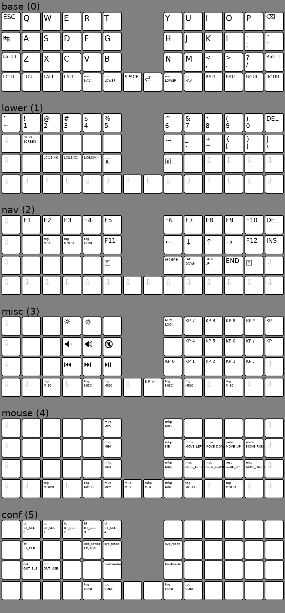

# Layouts

## Install

On fedora workstation 40:

```shell
dnf install dejavu-sans-fonts
dnf install google-noto-sans-symbols-fonts
dnf install google-noto-sans-symbols-2-fonts
```

## Flashing

First enter "misc" layer so it sticks on the keyboard halfs. Then flash the
dongle, double click the button to enter flash mode. Then carry out the rest of
the flashing as normal.

## Layout



## TODO

Fix different mouse speeds
